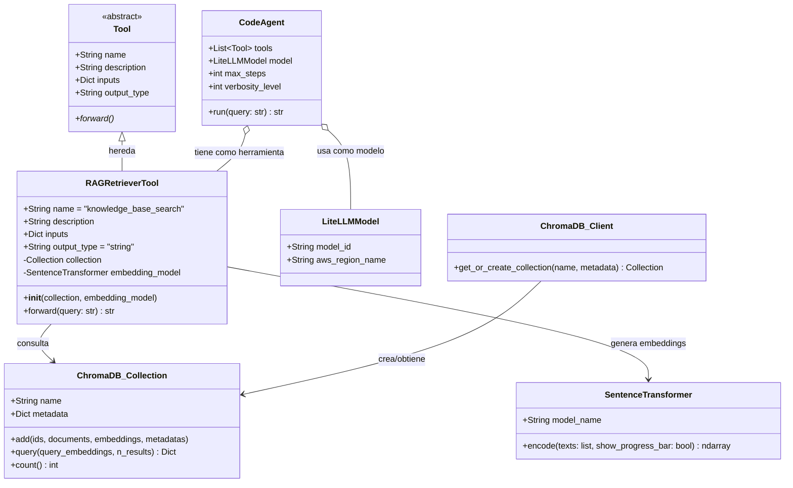
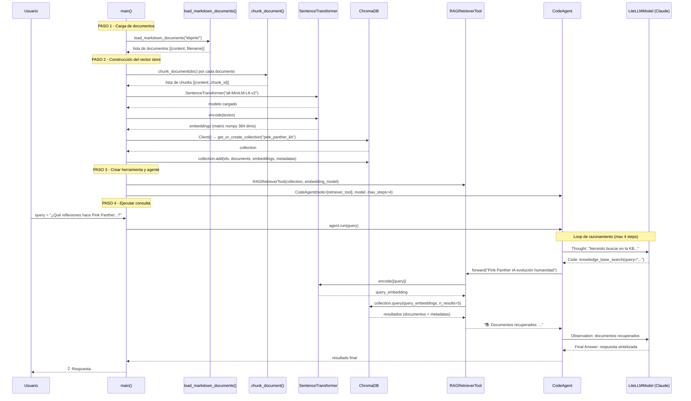
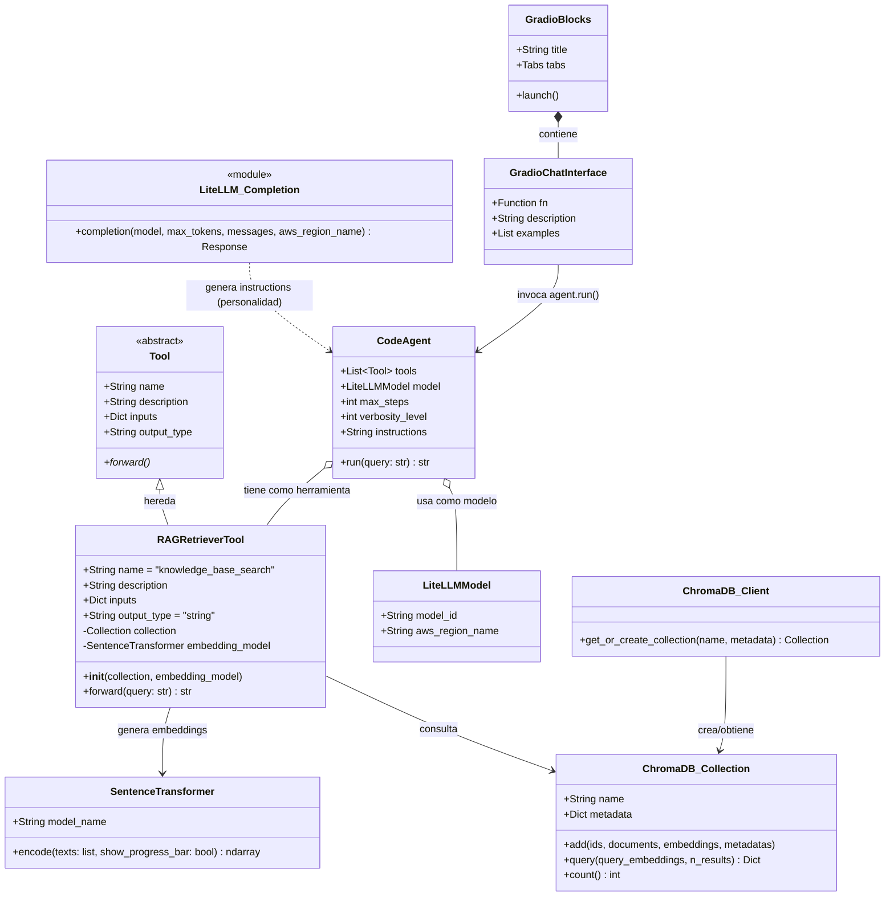
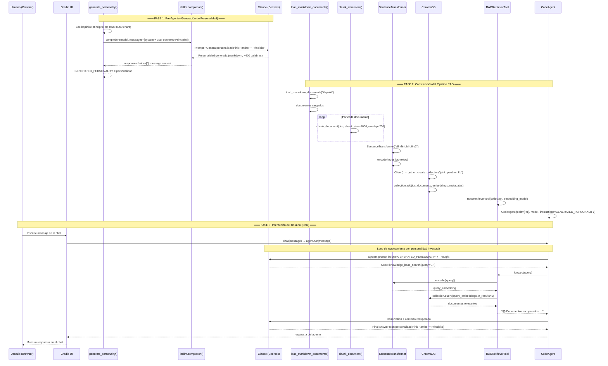
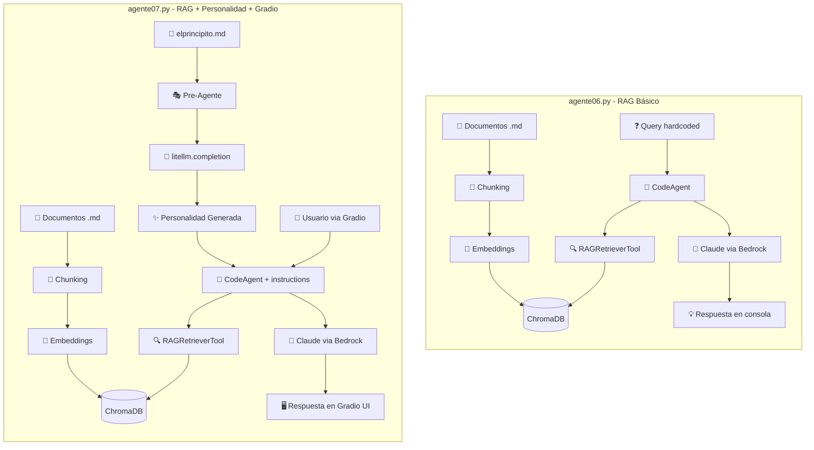

# Diagramas UML - Agentes RAG con smolagents

## Diagramas de Clases y Secuencia para `agente06.py` y `agente07.py`

---

## 1. Diagrama de Clases - agente06.py

---

## 2. Diagrama de Secuencia - agente06.py

---

## 3. Diagrama de Clases - agente07.py

---

## 4. Diagrama de Secuencia - agente07.py

---

## 5. Diagrama Comparativo de Arquitectura

---

## 6. Resumen de Diferencias

| Aspecto | agente06.py | agente07.py |
|---------|-------------|-------------|
| **Personalidad** | Sin personalidad (respuestas neutras) | Generada dinámicamente por un pre-agente |
| **Interfaz** | Consola (ejecución única) | Gradio (chat web interactivo) |
| **Entrada** | Query hardcoded en el código | Usuario escribe en tiempo real |
| **Fases** | 1 fase (pipeline RAG directo) | 2 fases (pre-agente + RAG) |
| **Parámetro `instructions`** | No usado | Personalidad inyectada como system prompt |
| **Dependencias extra** | Ninguna | `gradio`, `litellm` (llamada directa) |
| **Patrón arquitectónico** | RAG simple | "Agente que configura a otro agente" |
| **Reutilización** | Ejecución única y termina | Servidor persistente, múltiples consultas |

---

*Documento generado como material de apoyo para la clase de Agentes con RAG.*
